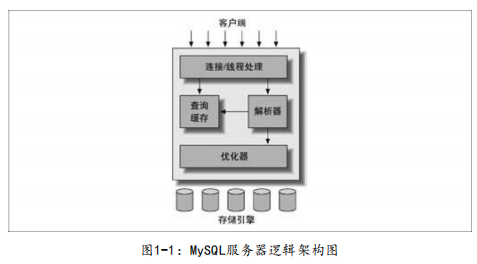

## MySQL 逻辑架构

- 最上层架构

  并非 MySQL 独有，大多数基于网络的客户端/服务器的工具或者服务都有类似的架构。比如连接处理，授权认证，安全等

  **连接管理**

  - 每个客户端连接都会在服务器拥有一个线程
  - 连接的查询只会在对应的线程里执行
  - 线程只能轮流在某个 CPU 核心或者 CPU 中进行
  - 服务器会负责缓存线程，不必为每一个新建的连接创建或销毁线程

  **安全性**

  - MySQL 服务器对客户端的连接会基于用户名，原始主机信息和密码进行认证
  - SSL 方式的连接下，还可以使用 X.509 证书认证
  - 客户端可以连接的情况下，验证该客户端的执行权限（是否允许对 world 数据库的 country 表执行 SELECT 语句）

  

- 第二层架构

  大多数的 MySQL 核心服务功能都在这一层，包括查询解析，分析，优化，缓存，以及所有内置函数（例如：日期，时间，数学，和加密函数），所有跨存储引擎的功能都在这一层实现：存储过程，触发器，视图等。

  - 对于 **SELECT** 语句，在解析查询之前，会检查查询缓存（Query Cache），如果找得到对应查询，会直接返回查询缓存中的结果集，而不会执行查询解析，优化和执行的整个过程。

  - 解析查询，并创建内部数据结构（解析树）

  - 优化查询（重写查询，决定表的读取顺序，选择合适的索引等）

    可以通过特殊的关键字提示 （hint）优化器，影响查询优化的决策

    可以请求优化器解释 （explain）优化过程的各个因素

  （第 6 章会讨论更多优化器细节）

  - **优化器不关心表使用的什么存储引擎，但存储引擎对于优化查询是有影响的**

  

- 第三层架构

  包含存储引擎（负责 MySQL 中数据的存储和提取），每个存储引擎各有它们的优势和劣势。服务器通过 API 与存储引擎进行通信。