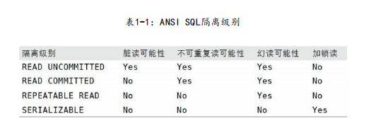

### 事务

ACID 表示原子性（atomicity），一致性（consistency），隔离性（isolation）和持久性（durability）

一个运行良好的事务处理系统，必须具备这些标准特征。

- 原子性

  对于一个事务来说，不可能只执行其中的一部分操作，要么全部成功提交，要么某个失败全部回滚，这就是原子性

- 一致性

  数据库总是从一个一致性的状态转移到另外一个一致性的状态

- 隔离性

  通常来说（隔离级别 isolation level），一个事务所做的修改在最终提交前，对其他事务是不可见的

- 持久性

  一旦事务提交，则其所做的修改就会永久保存到数据库中（持久性也分不同级别，不可能有 100% 的持久性保证策略）


**对于一些不需要事务的查询类应用，选择一个非事务型的存储引擎，可以获得更高的性能，即使存储引擎不支持事务，也可以通过 LOCK TABLES 语句为应用提供一定程度的保护**，所以 MySQL 的存储引擎架构可以根据业务的需求进行调整。


### 隔离级别

SQL 标准中定义了四种隔离级别，较低级别的隔离通常可以执行更高的并发，系统开销也更低。

> 每种存储引擎实现的隔离级别都不尽相同

- 未提交读 （READ UNCOMMITTED）

  事务中的修改，即使没有提交，对其他事务也是可见的。事务可以读取未提交的数据，**这也被称为脏读 （DIRTY READ）**

  - 性能并不会好很多，还会导致很多问题，除非必要，基本不使用此级别

- 提交读 （READ COMITTED）/ **不可重复读（NONREPEATABLE READ）**

  大多数的数据库默认的隔离级别都是 READ COMITTED （MySQL 不是），此级别满足上文定义的隔离性（isolation）:事务开始 时，只能“看见”已经提交的事务所做的修改。两次执行同样的查询，可能会得到不一样的结果，所以这个级别有时候也会叫做不可重复读

- 可重复读 (REPEATABLE READ) （MySQL 的默认事务隔离级别）

  可重复读解决了脏读的问题，保证在用一个事务中多次读取同样记录的结果是一致的。但是**无法解决幻读（PHANTOM READ）**问题，幻读是指：当某个事物在读取某个范围内的记录时，另外一个事务又在该范围内插入了新的纪录，当之前的事务再次读取该范围的记录时，会**产生幻行（PHANTOM ROW）**。InnoDB 和 XtraDB 存储引擎通过多版本并发控制（MVCC， Multiverison Concurrency Control）解决了幻读的问题。

- 可串行化（SERIALIZABLE）

  可串行化是最高的事务隔离级别，强制事务串行执行，避免了之前说得幻读问题。简单来说，可串行化会在读取的每一行数据上都加锁，所以可能导致大量的超时锁和锁争用的问题。

  实际应用中很少用到这个隔离级别，只有在非常需要确保数据的一致性，而且可以接受没有并发的情况下。才考虑采用该级别




### 死锁

两个或多个事务在同一资源上相互占用，并请求锁定对方占用的资源，从而导致恶性循环的现象。

- 当多个事务，试图以不同的顺序锁定资源时，就可能会产生死锁。
- 当多个事务同时锁定同一个资源时，也会产生死锁

1. 数据库系统实现了各种死锁检测和死锁超时机制。

2. 复杂的 InnoDB 存储引擎，能有效的检测到死锁的循环依赖，并立即返回一个错误。

3. 死锁有可能会导致非常慢的查询

4. InnoDB 处理死锁的方法是将持有最少行级排他锁的事务进行回滚（这是相对比较简单的死锁回滚算法）


死锁产生的原因：

- 真正的数据冲突，这种情况很难避免
- 由于存储引擎的实现方式导致的，以同样的顺序执行语句，有些存储引擎会产生死锁，有些则不会


死锁的处理

只有部分或者完全回滚其中一个事务，才能打破死锁。对于事务型的系统，是无法避免死锁的。


### MySQL 中的事务

MySQL 提供了两种事务型的存储引擎：InnoDB 和 NDB Cluster，以及一些第三方存储引擎包括 XtraDB 或者 PBXT 等

- MySQL 默认采用自动提交模式 （AUTOCOMMIT）模式。如果不是显式地开始一个事务，则每个查询都被当做一个书屋执行提交操作。可以用 ```SET AUTOCOMMIT = 1``` 来设置当前连接下，自动提交模式的开启和关闭。此选项对非事务型的表没有任何影响，例如 MyISAM 或者 内存表

- MySQL 可以识别所有的 4 个 ANSI 隔离级别，InnoDB 引擎也支持所有的隔离级别
- 在非事务型的表上执行事务相关的操作时， MySQL 通常时不会发出提醒，也不会报错的。有时候只有回滚的时候，才会发出一条警告，但大多数情况下，对非事务型的表都不会有提示，所以不要在一个事务中，混合使用事务型的存储引擎和非事务型的存储引擎
- InnoDB 采用的是两阶段锁定协议（two-phase locking protocol）
- 除了事务中禁用了AUTOCOMMIT，可以使用 LOCK TABLES 之外，其他任何时候都不要显式地执行 LOCK TABLES ，不管使用的是什么存储引擎

